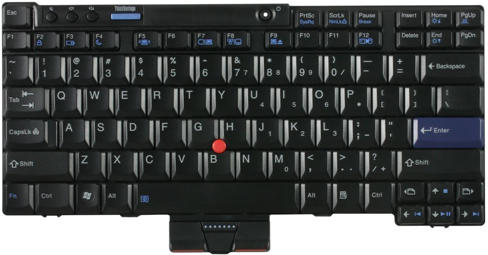

You don't need to be a programmer to use a command-driven computer system, but
you should be comfortable using a keyboard to type letters, numbers, and some
special symbols.

[bg]: https://github.com/kenjyco/x200/blob/master/Beginners-Guide.md
[1404]: https://github.com/kenjyco/x200/tree/master/sysinstall/mini-14.04

## X200 Laptop

A customized Lenovo X200 laptop will be used for this course. Your
instructor/mentor/tutor should supply you with a laptop that is all set to use.
The [beginners guide][bg] should help you out when you are on your own.

> System install and configuration will not be covered but the process is
> relatively straightforward. See [mini1404 setup][1404] and
> [kenjyco/dotfiles](https://github.com/kenjyco/dotfiles) if you are curious.

#### The X200 Keyboard

For keys that have blue symbols, you need to press the blue `Fn` key (lower left
area of the keyboard) at the same time to trigger that key's action. Examples

- `Fn` + `F12` to quickly "hibernate"
- `Fn` + `Home` to increase display brightness
